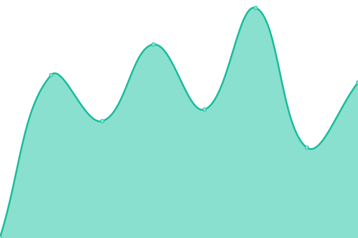
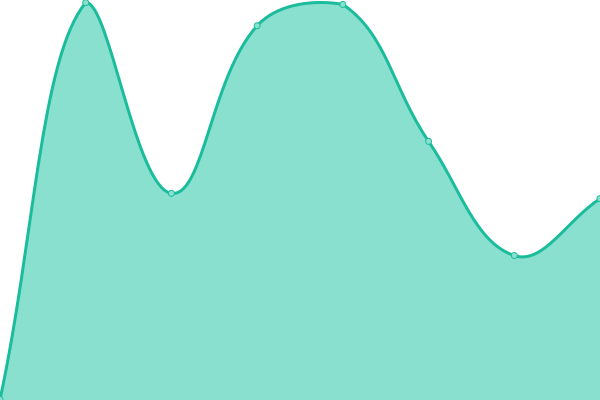

# [📈 Live Status](https://demo.upptime.js.org): <!--live status--> **🟧 Partial outage**

This repository contains the open-source uptime monitor and status page for [Upptime](https://upptime.js.org), powered by [Upptime](https://github.com/upptime/upptime).

With [Upptime](https://upptime.js.org), you can get your own unlimited and free uptime monitor and status page, powered entirely by a GitHub repository. We use [Issues](https://github.com/upptime/upptime/issues) as incident reports, [Actions](https://github.com/timoxoszt/sites-uptime/actions) as uptime monitors, and [Pages](https://demo.upptime.js.org) for the status page.

<!--start: status pages-->
<!-- This summary is generated by Upptime (https://github.com/upptime/upptime) -->
<!-- Do not edit this manually, your changes will be overwritten -->
<!-- prettier-ignore -->
| URL | Status | History | Response Time | Uptime |
| --- | ------ | ------- | ------------- | ------ |
|  [CyberJutsu](https://cyberjutsu.io) | 🟩 Up | [cyber-jutsu.yml](https://github.com/timoxoszt/sites-uptime/commits/HEAD/history/cyber-jutsu.yml) | 

 333ms
     
 | 

<a href="https://uptime.timoxoszt.me/history/cyber-jutsu">100.00%</a>
    

|  [Blog](https://blog.cyberjutsu.io) | 🟩 Up | [blog.yml](https://github.com/timoxoszt/sites-uptime/commits/HEAD/history/blog.yml) | 

 994ms
     
 | 

<a href="https://uptime.timoxoszt.me/history/blog">100.00%</a>
    

|  [Learn](https://learn.cyberjutsu.io) | 🟩 Up | [learn.yml](https://github.com/timoxoszt/sites-uptime/commits/HEAD/history/learn.yml) | 

 640ms
     
 | 

<a href="https://uptime.timoxoszt.me/history/learn">100.00%</a>
    

|  [Job](https://jobs.cyberjutsu.io) | 🟩 Up | [job.yml](https://github.com/timoxoszt/sites-uptime/commits/HEAD/history/job.yml) | 

 1038ms
     
 | 

<a href="https://uptime.timoxoszt.me/history/job">100.00%</a>
    

|  [Untrusted Data](https://ninja-academy.cyberjutsu-lab.tech) | 🟩 Up | [untrusted-data.yml](https://github.com/timoxoszt/sites-uptime/commits/HEAD/history/untrusted-data.yml) | 

 760ms
     
 | 

<a href="https://uptime.timoxoszt.me/history/untrusted-data">100.00%</a>
    

|  [File upload 1](http://fileupload.cyberjutsu-lab.tech:12001) | 🟩 Up | [file-upload-1.yml](https://github.com/timoxoszt/sites-uptime/commits/HEAD/history/file-upload-1.yml) | 

 534ms
     
 | 

<a href="https://uptime.timoxoszt.me/history/file-upload-1">100.00%</a>
    

|  [File upload 2](http://fileupload.cyberjutsu-lab.tech:12002) | 🟩 Up | [file-upload-2.yml](https://github.com/timoxoszt/sites-uptime/commits/HEAD/history/file-upload-2.yml) | 

 495ms
     
 | 

<a href="https://uptime.timoxoszt.me/history/file-upload-2">100.00%</a>
    

|  [File upload 3](http://fileupload.cyberjutsu-lab.tech:12003) | 🟩 Up | [file-upload-3.yml](https://github.com/timoxoszt/sites-uptime/commits/HEAD/history/file-upload-3.yml) | 

 487ms
     
 | 

<a href="https://uptime.timoxoszt.me/history/file-upload-3">100.00%</a>
    

|  [File upload 4](http://fileupload.cyberjutsu-lab.tech:12004) | 🟩 Up | [file-upload-4.yml](https://github.com/timoxoszt/sites-uptime/commits/HEAD/history/file-upload-4.yml) | 

 488ms
     
 | 

<a href="https://uptime.timoxoszt.me/history/file-upload-4">100.00%</a>
    

|  [File upload 5](http://fileupload.cyberjutsu-lab.tech:12005) | 🟩 Up | [file-upload-5.yml](https://github.com/timoxoszt/sites-uptime/commits/HEAD/history/file-upload-5.yml) | 

 510ms
     
 | 

<a href="https://uptime.timoxoszt.me/history/file-upload-5">100.00%</a>
    

|  [File upload 6](http://fileupload.cyberjutsu-lab.tech:12006) | 🟩 Up | [file-upload-6.yml](https://github.com/timoxoszt/sites-uptime/commits/HEAD/history/file-upload-6.yml) | 

 491ms
     
 | 

<a href="https://uptime.timoxoszt.me/history/file-upload-6">100.00%</a>
    

|  [Path Traversal 1](http://pathtraversal.cyberjutsu-lab.tech:8091) | 🟩 Up | [path-traversal-1.yml](https://github.com/timoxoszt/sites-uptime/commits/HEAD/history/path-traversal-1.yml) | 

 629ms
     
 | 

<a href="https://uptime.timoxoszt.me/history/path-traversal-1">100.00%</a>
    

|  [Path Traversal 2](http://pathtraversal.cyberjutsu-lab.tech:8092) | 🟩 Up | [path-traversal-2.yml](https://github.com/timoxoszt/sites-uptime/commits/HEAD/history/path-traversal-2.yml) | 

 587ms
     
 | 

<a href="https://uptime.timoxoszt.me/history/path-traversal-2">100.00%</a>
    

|  [Path Traversal 3](http://pathtraversal.cyberjutsu-lab.tech:8093) | 🟩 Up | [path-traversal-3.yml](https://github.com/timoxoszt/sites-uptime/commits/HEAD/history/path-traversal-3.yml) | 

 621ms
     
 | 

<a href="https://uptime.timoxoszt.me/history/path-traversal-3">100.00%</a>
    

|  [Path Traversal 4](http://pathtraversal.cyberjutsu-lab.tech:8094) | 🟩 Up | [path-traversal-4.yml](https://github.com/timoxoszt/sites-uptime/commits/HEAD/history/path-traversal-4.yml) | 

 856ms
     
 | 

<a href="https://uptime.timoxoszt.me/history/path-traversal-4">100.00%</a>
    

|  [Path Traversal 5](http://pathtraversal.cyberjutsu-lab.tech:8095) | 🟩 Up | [path-traversal-5.yml](https://github.com/timoxoszt/sites-uptime/commits/HEAD/history/path-traversal-5.yml) | 

 884ms
     
 | 

<a href="https://uptime.timoxoszt.me/history/path-traversal-5">100.00%</a>
    

|  [Path Traversal 6](http://pathtraversal.cyberjutsu-lab.tech:8096) | 🟩 Up | [path-traversal-6.yml](https://github.com/timoxoszt/sites-uptime/commits/HEAD/history/path-traversal-6.yml) | 

 588ms
     
 | 

<a href="https://uptime.timoxoszt.me/history/path-traversal-6">100.00%</a>
    

|  [Symlink Readfile / RCE](http://symlink.cyberjutsu-lab.tech:9091) | 🟥 Down | [symlink-readfile-rce.yml](https://github.com/timoxoszt/sites-uptime/commits/HEAD/history/symlink-readfile-rce.yml) | 

 504ms
     
 | 

<a href="https://uptime.timoxoszt.me/history/symlink-readfile-rce">76.30%</a>
    

|  [Command Injection 1](http://cmdi.cyberjutsu-lab.tech:3001) | 🟩 Up | [command-injection-1.yml](https://github.com/timoxoszt/sites-uptime/commits/HEAD/history/command-injection-1.yml) | 

 485ms
     
 | 

<a href="https://uptime.timoxoszt.me/history/command-injection-1">100.00%</a>
    

|  [Command Injection 2](http://cmdi.cyberjutsu-lab.tech:3002) | 🟩 Up | [command-injection-2.yml](https://github.com/timoxoszt/sites-uptime/commits/HEAD/history/command-injection-2.yml) | 

 481ms
     
 | 

<a href="https://uptime.timoxoszt.me/history/command-injection-2">100.00%</a>
    

|  [Command Injection 3](http://cmdi.cyberjutsu-lab.tech:3003) | 🟩 Up | [command-injection-3.yml](https://github.com/timoxoszt/sites-uptime/commits/HEAD/history/command-injection-3.yml) | 

 484ms
     
 | 

<a href="https://uptime.timoxoszt.me/history/command-injection-3">100.00%</a>
    

|  [Command Injection 4](http://cmdi.cyberjutsu-lab.tech:3004) | 🟩 Up | [command-injection-4.yml](https://github.com/timoxoszt/sites-uptime/commits/HEAD/history/command-injection-4.yml) | 

 480ms
     
 | 

<a href="https://uptime.timoxoszt.me/history/command-injection-4">100.00%</a>
    

|  [Command Injection 5](http://cmdi.cyberjutsu-lab.tech:3005) | 🟩 Up | [command-injection-5.yml](https://github.com/timoxoszt/sites-uptime/commits/HEAD/history/command-injection-5.yml) | 

 490ms
     
 | 

<a href="https://uptime.timoxoszt.me/history/command-injection-5">100.00%</a>
    

|  [Command Injection 6](http://cmdi.cyberjutsu-lab.tech:3006) | 🟩 Up | [command-injection-6.yml](https://github.com/timoxoszt/sites-uptime/commits/HEAD/history/command-injection-6.yml) | 

 479ms
     
 | 

<a href="https://uptime.timoxoszt.me/history/command-injection-6">100.00%</a>
    

|  [Command Injection 7](http://cmdi.cyberjutsu-lab.tech:3007) | 🟩 Up | [command-injection-7.yml](https://github.com/timoxoszt/sites-uptime/commits/HEAD/history/command-injection-7.yml) | 

 480ms
     
 | 

<a href="https://uptime.timoxoszt.me/history/command-injection-7">100.00%</a>
    

|  [HTML Injection 1](https://note1.cyberjutsu-lab.tech) | 🟥 Down | [html-injection-1.yml](https://github.com/timoxoszt/sites-uptime/commits/HEAD/history/html-injection-1.yml) | 

 760ms
     
 | 

<a href="https://uptime.timoxoszt.me/history/html-injection-1">72.99%</a>
    

|  [HTML Injection 2](https://note2.cyberjutsu-lab.tech) | 🟥 Down | [html-injection-2.yml](https://github.com/timoxoszt/sites-uptime/commits/HEAD/history/html-injection-2.yml) | 

 752ms
     
 | 

<a href="https://uptime.timoxoszt.me/history/html-injection-2">72.99%</a>
    

|  [HTML Injection 3](https://note3.cyberjutsu-lab.tech) | 🟥 Down | [html-injection-3.yml](https://github.com/timoxoszt/sites-uptime/commits/HEAD/history/html-injection-3.yml) | 

 749ms
     
 | 

<a href="https://uptime.timoxoszt.me/history/html-injection-3">72.99%</a>
    

|  [HTML Injection 4](https://note4.cyberjutsu-lab.tech) | 🟥 Down | [html-injection-4.yml](https://github.com/timoxoszt/sites-uptime/commits/HEAD/history/html-injection-4.yml) | 

 863ms
     
 | 

<a href="https://uptime.timoxoszt.me/history/html-injection-4">72.99%</a>
    

|  [HTML Injection 5](https://note5.cyberjutsu-lab.tech) | 🟥 Down | [html-injection-5.yml](https://github.com/timoxoszt/sites-uptime/commits/HEAD/history/html-injection-5.yml) | 

 987ms
     
 | 

<a href="https://uptime.timoxoszt.me/history/html-injection-5">72.99%</a>
    

|  [HTML Injection 6](https://note6.cyberjutsu-lab.tech) | 🟥 Down | [html-injection-6.yml](https://github.com/timoxoszt/sites-uptime/commits/HEAD/history/html-injection-6.yml) | 

 746ms
     
 | 

<a href="https://uptime.timoxoszt.me/history/html-injection-6">72.99%</a>
    

|  [SQL Injection 1-8](http://sqli.cyberjutsu-lab.tech:24001) | 🟥 Down | [sql-injection-1-8.yml](https://github.com/timoxoszt/sites-uptime/commits/HEAD/history/sql-injection-1-8.yml) | 

 612ms
     
 | 

<a href="https://uptime.timoxoszt.me/history/sql-injection-1-8">59.99%</a>
    

|  [PHP Deserialization 1-4](http://game-pokemon.cyberjutsu-lab.tech:15001) | 🟩 Up | [php-deserialization-1-4.yml](https://github.com/timoxoszt/sites-uptime/commits/HEAD/history/php-deserialization-1-4.yml) | 

 909ms
     
 | 

<a href="https://uptime.timoxoszt.me/history/php-deserialization-1-4">100.00%</a>
    

<!--end: status pages-->

[**Visit our status website →**](https://uptime.timoxoszt.me)

## 📄 License

- Powered by: [Upptime](https://github.com/upptime/upptime)
- Code: [MIT](./LICENSE) © [Anand Chowdhary](https://anandchowdhary.com), supported by [Pabio](https://pabio.com)
- Data in the `./history` directory: [Open Database License](https://opendatacommons.org/licenses/odbl/1-0/)
